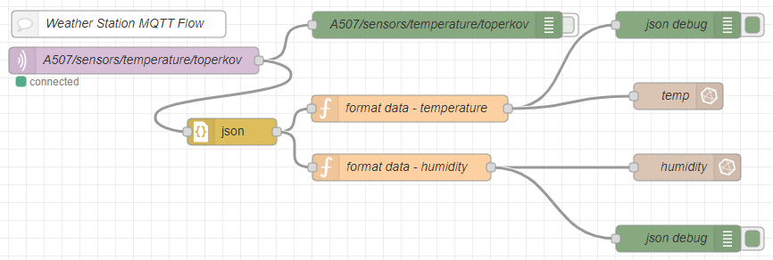
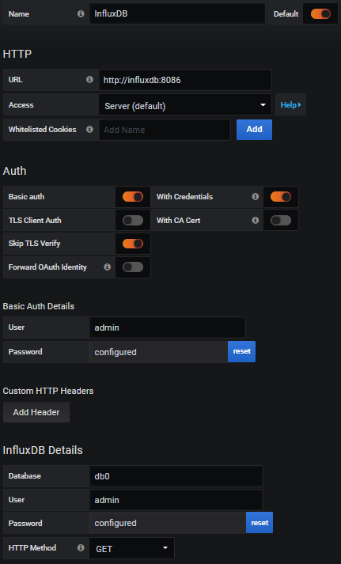

# Bežične senzorske mreže - Lab 8

### FESB, smjer 110/111/112/114/120, akademska godina 2019/2020

## Docker container


Kontejner (eng. *Container*) predstavlja jedinicu softvera koja pakira cjelokupan kod, aplikaciju, potrebne biblioteke i komponente o kojima aplikacija ovisi. U kontejner praktički pakiramo sve ono što je potrebno za pokretanje neke aplikacije. Na taj način kontejner možemo prenositi i pokretati bilo gdje, neovisno o distribuciji operacijskog sustava i infrastrukturi na kojoj se pokreće. [Docker](https://www.docker.com/) je alat dizajniran kako bi korisniku olakšao stvaranje, implementaciju i pokretanje aplikacija pomoću kontejnera.

U sklopu današnje vježbe student će iskoristiti funkcionalnosti docker kontejnera kako bi pokrenuo aplikacije za prikupljanje podataka, pohranu u bazu i vizualizaciju u obliku grafova.

## docker-compose nodered+influxdb+grafana

Multi-container Docker aplikacija upotrebljava sljedeće servise:

* [Node-RED](https://nodered.org/) - *flow-based* razvojni alat za vizualno programiranje
* [InfluxDB](https://github.com/influxdata/influxdb) - *time series* baza podataka
* [Chronograf](https://github.com/influxdata/chronograf) - admin korisničko sučelje za InfluxDB
* [Grafana](https://github.com/grafana/grafana) - vizualizacijsko korisničko sučelje za InfluxDB

## Quick Start

Da biste pokrenuli aplikaciju:

1. Instalirajte [docker-compose](https://docs.docker.com/compose/install/) na vaše računalo. Ako imate instaliran 
[Docker Desktop](https://www.docker.com/products/docker-desktop), onda nije potrebna instalacija docker-compose.
2. Klonirajte repozitorij na vaše vaše računalo.
3. Pozicionirajte se u direktorij [lab-8](labs/lab-8) u kojem se nalazi datoteka `docker-compose.yml` te pokrenite sljedeću komandu iz terminala:
```
docker-compose -f docker-compose.yml -p myProject up
```

> NAPOMENA: Ako prvi put pokrećete docker-compose pričekajte da se skinu i konfiguriraju kontejneri sa repozitorija.

Da biste zaustavili aplikaciju pritisnite `CRTL+C`.

## Portovi

Servisi u aplikaciji rade na sljedećim portovima:

| Host Port | Service |
| - | - |
| 1880 | Node-RED |
| 3000 | Grafana |
| 8086 | InfluxDB |
| 127.0.0.1:8888 | Chronograf |

## Volumeni

Aplikacija kreira sljedeće volumene (za svaku od navedenih servisa) tako da se podaci ne izgube kada se aplikacija zaustavi:

* influxdb-storage
* chronograf-storage
* grafana-storage
* node-red-data


## Korisnici

Aplikacija kreira dva admin korisnika - jednog za InfluxDB i jednog za Grafanu. Po defaultu, korisničko ime i lozinka obaju korisničkih računa je `admin`. Da biste poništili zadane vjerodajnice (korisničko ime i lozinku), prije pokretanja aplikacije postavite sljedeće varijable u datoteci [`docker-compose.yml`](labs/lab-8/docker-compose.yml):

* `INFLUXDB_USERNAME`
* `INFLUXDB_PASSWORD`
* `GRAFANA_USERNAME`
* `GRAFANA_PASSWORD`

## Baza podataka

Aplikacija kreira InfluxDB bazu podataka pod nazivom `db0`. Za pristup korisničkom sučelju InfluxDB baze podataka koristimo Chronograf kojem možete pristupiti preko web preglednika: `localhost:8888`.

## Node-RED

Za pristup Node-RED servisu u web pregledniku upišite: `localhost:1880`. U direktoriju [`lab-8`](labs/lab-8): se nalazi flowchart `flow.json` čiji ćete sadržaj ubaciti u Node-RED. Kao rezultat u nastavku ćete dobiti flowchart prikazan na slici ispod. Kao što možete primjetiti, Node-RED se spaja na MQTT broker te se pretplaćuje na određenu temu. Podaci koji stižu sa brokera se parsiraju i zapisuju u InfluxDB bazu podataka `db0`.




## Grafana

U web pregledniku upišite `localhost:3000` da biste pristupili Grafani. Kliknite na `Add data source` te označite `InfluxDB`. Nakon toga konfigurirajte InfluxDB kao što je prikazano na slici ispod.



