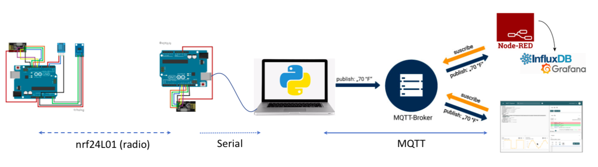

# Bežične senzorske mreže - Lab 9

### FESB, smjer 110/111/112/114/120, akademska godina 2019/2020

## Projekt



## nrf24L01 TX

Krajnji senzorsk uređaje za čitanje vrijednosti temperature i osvjetljenja je spojen prema slici:


Kod za krajnji senzorski uređaj se nalazi u direktoriju [``lab-9``](labs/lab-9) u datoteci ``src.zip``. Kao što se može primjetiti, kod je organiziran pomoću *state mašin*e. Također, radi jednostavnosti razumijevanja rada, kod je razbijen u dvije biblioteke, jednu za čitanje senzora, te drugu za slanje/primanje poruka preko radio kanala.


## nrf24L01 RX


U direktoriju [``lab-9``](labs/lab-9) se nalazi kod za receiver (``main.cpp``) pa ga skinite na računalo i testirajte.

## Python code - Serial to MQTT

Iz direktorija [lab-9](labs/lab-9) skinite python datoteku `serial_read_mqtt.py` te pokrenite sljedeću komandu iz terminala:
```python
python serial_read_mqtt.py
```

>Napomena: koristite verziju python 3

Primjetite da bi se poruka uspješno poslala prema brokeru, Arduino preko serijskog porta mora biti poslana u formatu npr. **"T: 25.3!"** ili **"L: 124!"**. Prema tome, ako nije, prilagodite kod na Arduino Receiveru (nrf24L01 RX) kako bi slao podatke prema serijskom portu u navedenom formatu.

## Docker - Node-RED / InfluxDB / Grafana

Da biste pokrenuli aplikaciju iz direktorija [lab-9](labs/lab-9) skinite datoteku `docker-compose.yml` te pokrenite sljedeću komandu iz terminala:
```
docker-compose -f docker-compose.yml -p myProject up
```

Za pristup Node-RED servisu u web pregledniku upišite: `localhost:1880`. U direktoriju [`lab-9`](labs/lab-9): se nalazi flowchart `flow.json` čiji ćete sadržaj ubaciti u Node-RED. 

Servisi u aplikaciji rade na sljedećim portovima:

| Host Port | Service |
| - | - |
| 1880 | Node-RED |
| 3000 | Grafana |
| 8086 | InfluxDB |
| 127.0.0.1:8888 | Chronograf |